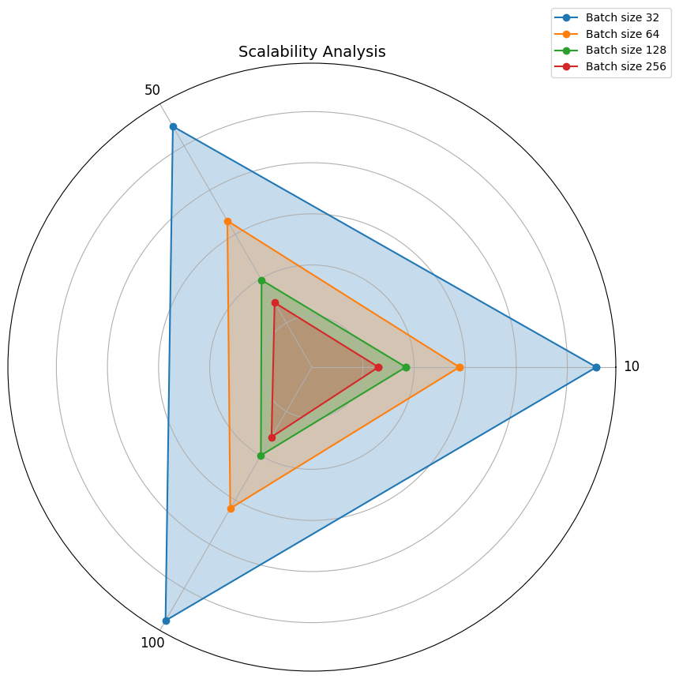

# Communication Overhead Analysis in Distributed Deep Federated Learning

## Overview

This project aims to analyze and optimize communication overhead in federated learning systems, specifically within the context of distributed deep learning using the UNSW-NB15 dataset for network intrusion detection. The focus is on implementing efficient client-server communication and optimizing data transfer processes to improve overall system performance.

## Technical Plan

### 1. Initial Setup

**Access NERSC’s Perlmutter:**
- Ensure you have an active account and necessary permissions.
- Familiarize yourself with user guides and documentation.

**Environment Setup:**
- Load Necessary Modules:
  - : `module load python`
  
### Installing Dependencies

2. **Using Conda**:
   If you are using Conda, you can create a new environment and install the dependencies from the `requirements.txt` file by running the following commands:

   ```shell
   conda create --name your_env_name python=3.9
   conda activate your_env_name
   pip install -r requirements.txt

### 3. Baseline Run

**Execute Existing Code:**
- Run federated learning code on the UNSW dataset.

**Collect Baseline Data:**
- Measure and record communication overhead metrics such as average round trip time (RTT) in seconds, uplink and downlink data transfer in megabytes (MB), computation and communication time per round in seconds.
- Track model performance metrics such as accuracy per round as well as final accuracy with early stopping, F1-score, precision, recall, ROC AUC, and Matthews Correlation Coefficient (MCC).

### 4. Profiling and Analysis

**Profiling Tools:**
- Utilize HPC profiling tools to analyze communication patterns:
  - **Score-P**: Install, configure, and instrument code to collect performance data.
  - **Tau**: Install, configure, and instrument the code for detailed performance analysis.

**Identify Bottlenecks:**
- Analyze the profiling data to identify major sources of communication overhead.
- Focus on functions or communication calls that take the most time or resources.

### 5. Optimization Strategies

**Data Parallelism:**
- Distribute the dataset across multiple nodes.
- Implement using frameworks like TensorFlow or PyTorch’s distributed package.

**Model Parallelism:**
- Divide the neural network model across different nodes.
- Use model parallelism techniques available in deep learning frameworks.

### 6. Performance Modeling

**Simulate Different Strategies:**
- Use performance modeling tools to simulate various optimization strategies:
  - **Score-P and Cube**: Collect and visualize profiling data to understand the impact of different optimizations.

**Develop Models:**
- Develop performance models based on simulation results to predict the efficiency of different strategies.


## Code Structure

###  Scripts:
1. `federated_learning_main.py`: The main script to run federated learning experiments. It sets up the experiment, loads data, and executes the federated learning process.

2. `utils.py`: Contains utility functions for data loading, preprocessing, and federated learning implementation. This includes functions for:
   - Data loading and preprocessing
   - Model definition
   - Federated learning algorithms
   - Metric calculations

### Jupyter Notebooks:
3. `insights_viz.ipynb`: Jupyter notebook for visualizing and analyzing the results of the federated learning experiments. It includes plots for:
   - Learning curves
   - Performance comparison heatmaps
   - Communication overhead analysis
   - Computation vs. Communication time comparisons
   - Efficiency metrics

4. `fed_learning_basic.ipynb`: This notebook contains the initial data preprocessing steps for the UNSW-NB15 dataset. It includes:
   - Loading the dataset
   - Separating features and target variables
   - Identifying categorical columns
   - Applying one-hot encoding to categorical columns and scaling to numerical columns
   - Splitting the data into training and testing sets
   - Converting data to numpy arrays for compatibility with deep learning frameworks

This notebook serves as the starting point for the federated learning process, preparing the data for use in the main federated learning script.

### Other Files:
5. `requirements.txt`: Lists all the  dependencies required to run the project.

6. `README.md`: Provides an overview of the project, instructions for setup and running experiments, and summary of current progress.


## Current Progress in baseline model
## Scalability in baseline approach


All baseline models were ran using the Exclusive CPU Node on Perlmutter, equipped with AMD EPYC 7763 64-Core Processor (256 CPUs) and 503 GiB of memory, to ensure consistent performance.

Conducted federated learning experiments on the UNSW-NB15 dataset for network intrusion detection, exploring various configurations:

- Number of clients: 10, 50, 100
- Batch sizes: 32, 64, 128, 256

Key findings:

1. Learning Curves:
   - Smaller batch sizes (32, 64) converge faster and achieve higher accuracies.
   - Fewer clients (10) generally yield better performance.
   - Best configuration: 10 clients, batch size 32 (Accuracy: 0.986)
   - Worst configuration: 100 clients, batch size 256 (Accuracy: 0.551)

2. ROC AUC Performance:
   - Best configuration: 10 clients, batch size 32 (ROC AUC: 0.9838)

3. Computation vs. Communication Time:
   - Computation time significantly outweighs communication time across all configurations.
   - Larger batch sizes reduce computation time but have minimal impact on communication time.

4. Efficiency (Accuracy Gain per MB):
   - Configurations with fewer clients (10) show higher efficiency.
   - Smaller batch sizes tend to be more efficient in terms of accuracy gain per data transferred.

5. Scalability:
   - Larger batch sizes (128, 256) scale better with increasing client numbers.
   - Smaller batch sizes (32, 64) show poorer scalability as client numbers increase.

The baseline results provide insights into the trade-offs between model performance, communication efficiency, and scalability in federated learning setups.

## Communication Metrics in Baseline

**Average_RTT (s):**
   Average Round Trip Time in seconds, representing the average time for a complete client-server communication cycle.
   Calculated as: `total_comm_time / num_clients`

**Uplink_Data(MB):**
   The amount of data in megabytes sent from clients to the server in this round.
   Calculated using: `calculate_model_size(client_model)` for each client

**Downlink_Data(MB):**
   The amount of data in megabytes sent from the server to clients in this round.
   Calculated using: `calculate_model_size(client_model)` for each client

**Total_Data_Transferred(MB):**
   The total amount of data transferred (both uplink and downlink) in megabytes for this round.
   Calculated as: `total_uplink_data + total_downlink_data`

**Computation_Time(s):**
   The time spent on local computations by clients in seconds for this round.
   Measured within the `client_update()` function and summed for all clients

**Communication_Time(s):**
   The time spent on communication between clients and server in seconds for this round.
   Calculated as the sum of downlink and uplink times for all clients

**Round_Total_Time(s):**
   The total time taken to complete this round, including both computation and communication.
   Measured using `time.time()` at the start and end of each round
     
## Getting Started (baseline experiments)


### Step 1: To run baseline experiments, specify the number of clients, number of rounds, and batch size as arguments:
```sh
 federated_learning_main.py <num_clients> <batch_size> #Replace `<num_clients>` with the number of clients (e.g., 10, 50, 100) and `<batch_size>` with the desired batch size (e.g., 32, 64, 128, 256).

```

Pressing Ctrl+C will terminate all processes

### Running Score-P for Baseline Experiments
Ensure Score-P and CubeGUI are installed and built:

Navigate to your CubeGUI directory and build if not done already:

```sh
 cd ~/cubegui-4.8.2
./configure --prefix=$HOME/cubegui
make
make install

```
Export environment variables for Score-P:

```sh
export SCOREP_ENABLE_PROFILING=true
export SCOREP_ENABLE_TRACING=false

```
 
### Using CubeGUI to Analyze Profiling Data
Opening CubeGUI
 Locate the CubeGUI executable:
 Run the CubeGUI executable:
```sh
/global/homes/b/billmj/fl_unsw/cubegui-4.8.2/_build/build-frontend/.libs/cube

```

 Load profiling data:
 In the CubeGUI file dialog, navigate to the directory containing the profiling data:
```sh
/global/homes/b/billmj/fl_unsw

```
Select the desired profiling directory and open the profile.cubex file.

To open profiling data for a specific configuration:
```sh
/global/homes/b/billmj/fl_unsw/cubegui-4.8.2/_build/build-frontend/.libs/cube /global/homes/b/billmj/fl_unsw/<profiling_directory>/profile.cubex

```
Replace <profiling_directory> with the appropriate directory name, such as scorep_20240720_231846_clients10_batch32.


### Distributed Data Parallel Federated Learning

We implement a Distributed Data Parallel (DDP) approach for Federated Learning using PyTorch on the UNSW-NB15 dataset for network intrusion detection.

## Features

- Distributed Data Parallel (DDP) implementation
- Dynamic learning rate adjustment
- Multi-GPU support
- Federated Averaging (FedAvg) algorithm
- Performance visualization

## Dependencies

- Python 3.9+
- CUDA 12.2 (for GPU support)
- MPI Libraries (for inter-node communication)

### Python Packages

- torch
- torchvision
- numpy
- scipy
- pandas
- matplotlib
- mpi4py

## Usage

To run distributed data parallel experiments, use the following command:

```sh
python federated_learning_ddp.py <num_clients> <batch_size>
```

Replace `<num_clients>` with the number of clients (e.g., 10, 50, 100) and `<batch_size>` with the desired batch size (e.g., 32, 64, 128, 256).

## Technical Details

### Learning Rate Adjustment

The learning rate is dynamically adjusted based on the number of clients using the square root scaling rule:

```python
adjusted_lr = initial_lr * sqrt(num_clients)
```

Where `initial_lr` is set to 0.001.

### Model Architecture

We start with a simple neural network with the following structure:

- Input layer
- Hidden layer (16 units) with ReLU activation and dropout (0.3)
- Hidden layer (8 units) with ReLU activation and dropout (0.3)
- Output layer (1 unit) with Sigmoid activation

### Federated Learning Process

1. The data is split among `num_clients` clients.
2. Each client performs local training for a specified number of epochs.
3. The server aggregates the model updates.
4. The process repeats for a set number of rounds.

## Results

After running the experiment, you can find the following in the `experiments_ddp` directory:

- Final model checkpoints
- Performance metrics (accuracy, F1-score, etc.)
- Learning curve plots


## Next Steps/Plans
- Perform detailed profiling to identify bottlenecks in the current system.

## Acknowledgments

This research used resources of the National Energy Research Scientific Computing Center, a DOE Office of Science User Facility supported by the Office of Science of the U.S. Department of Energy under Contract No. DE-AC02-05CH11231 using NERSC award ASCR-ERCAP0030084.
